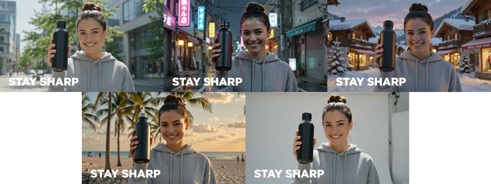
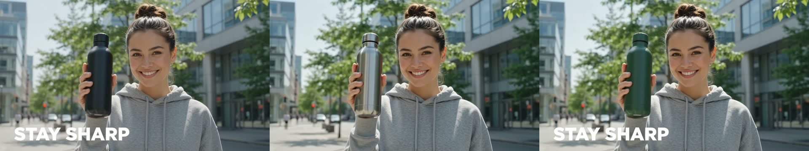

# Brand-Videos skalieren mit Claude + Gemini Omni

Vier Claude-Code-Skills, die ein **vorhandenes Video verändern**, statt neu zu
drehen. Hintergrund tauschen, Perspektive wechseln, Material umfärben,
On-Screen-Text übersetzen.

```
/swap-background    gleiche Aufnahme, neue Szene
/change-angle       neue Perspektive aus demselben Take
/transform-object   neues Material, gleiches Produkt
/localize           On-Screen-Text in einer anderen Sprache
```


**Setup in fünf Minuten:** [SETUP.md](SETUP.md) ·
**Markenkontext:** [brand/brand.md](brand/brand.md) ·
**Beispiel-Durchlauf:** [examples/](examples/README.md)

---

## Kurz gefasst

Google hat Gemini Omni über API veröffentlicht, aufgeteilt in vier Endpoints
mit je einem Zweck:

| Endpoint | Nimmt | Kann nicht |
|---|---|---|
| `gemini-omni-flash` | nur Text | keine Bilder, kein Video rein |
| `gemini-omni-flash/edit` | Clip + eine Anweisung | keine Referenzbilder |
| `gemini-omni-flash/image-to-video` | ein Standbild | kein Video rein |
| `gemini-omni-flash/reference-to-video` | Prompt + Referenzbilder | kein Video rein |

**Stark ist Omni bei genau einer Sache: einfache Video-zu-Video-Edits.** Du
gibst ihm einen Clip, den du schon hast, plus eine Anweisung in Alltagssprache,
und er ändert das eine Ding an Ort und Stelle — Bewegung, Bildausschnitt und
Licht bleiben stehen.

Für frei generierte Clips in Top-Qualität sind Kling 3.0 oder Seedance die
stärkeren Modelle. Darum geht es hier nicht. Es geht um die schmale Handvoll
Fälle, in denen der In-Place-Edit genau das richtige Werkzeug ist — und dieses
Repo deckt sie ab.

## Warum das an Claude hängen?

Omni ist der Motor, Claude sagt ihm, wie er laufen soll.

Für sich genommen nimmt Omni einen Prompt. An Claude angeschlossen nimmt es
deine Marke. Du trägst den Markenkontext **einmal** in
[`brand/brand.md`](brand/brand.md) ein — Produkte und wie sie im Prompt heißen,
Colourways, Szenen die passen und Szenen die nicht passen, Märkte und Sprachen,
Talent, Tabus. Danach hält Claude das alles und schreibt jeden Omni-Aufruf für
dich, jedes Mal markenkonform.

Konkret ist der Unterschied dieser:

> **Ohne:** `--object "the black insulated bottle" --to "brushed stainless steel"`
> — jedes Mal selbst formulieren, und beim Produktnamen jedes Mal raten, welche
> Bezeichnung das Modell überhaupt findet.
>
> **Mit:** „Zeig mir die Flasche in unseren Colourways." Claude liest Abschnitt 2
> und 3 der Markendatei und baut den Aufruf.

Die Markendatei landet bewusst **nicht** im Prompt an Omni. Der Edit-Endpoint
arbeitet am besten mit einer kurzen Anweisung; jeder zusätzliche Satz ist eine
weitere Erlaubnis, etwas umzubauen. Der Markenkontext steuert, *welchen* Text
Claude in `--to` schreibt, nicht wie lang er wird.

## Wie der Edit arbeitet

Ein Clip rein, eine Anweisung, ein Clip raus. Bewegung, Framing und Schnitte
des Originals bleiben. Hintergrund, Material, Kameraperspektive oder Text im
Bild ändern sich, ohne dass jemand noch mal die Kamera aufbaut.

Der Haken, den man vorher kennen sollte: **der Edit nimmt Textanweisungen, keine
Referenzbilder.** Du kannst also kein exaktes Produkt und kein bestimmtes
Gesicht in einen bestehenden Clip setzen. Das braucht Referenz plus Motion
Control und ist ein anderer Aufbau.

Ausgabe ist 720p bei 24 fps, mit Ton, in der Länge der Quelle: 1280×720 bei
querformatiger Quelle, 720×1280 bei hochformatiger. Gemessen an beiden.

Und damit klar ist, wie wenig dahintersteckt — das ist der komplette Aufruf.
Du fasst das nie an, `scripts/omni.py` erledigt Upload, Warteschlange,
Download und Kontaktblatt drumherum:

```python
import fal_client

result = fal_client.subscribe("google/gemini-omni-flash/edit", arguments={
    "video_url": "https://.../clip.mp4",
    "prompt": "Change only the background to a snowy alpine village at dusk. "
              "Keep everything else the same.",
})
print(result["video"]["url"])
```

Der ganze Rest dieses Repos ist die Frage, **was** in diesem Prompt steht und
**wie** du prüfst, was zurückkommt.

## Die vier Skills

| Skill | Wofür | Die eine Variable |
|---|---|---|
| `/swap-background` | Ein Dreh, mehrere Märkte, Jahreszeiten oder Settings | die neue Szene |
| `/change-angle` | Aus einem Take eine schnittfähige Sequenz machen | die Perspektive |
| `/transform-object` | Colourways und Finishes testen, ohne Muster | Material oder Farbe |
| `/localize` | Ein Master-Clip, mehrere Sprachmärkte | die Zielsprache |

Alle vier laufen auf `google/gemini-omni-flash/edit`. Der eigentliche Inhalt
sind nicht die Skripte, sondern die **Prompt-Rezepte** in `scripts/omni.py` und
die **Prüf-Checklisten** in den `SKILL.md`-Dateien. Beides ist an echten Läufen
kalibriert, nicht geraten — siehe „Grenzen" unten.

## Der eigentliche Hebel ist Menge

Ein Asset wird zu vielen. Gleiche Aufnahme, eine Variable getauscht, neue
Zielgruppe. Deshalb ist jede Variablen-Option **wiederholbar**: ein Befehl, eine
Warteschlange, am Ende ein Überblicksbild über alle Varianten.

```bash
# drei Märkte aus einem Dreh
python3 scripts/omni.py swap-background --input clip.mp4 \
  --to "a rainy Tokyo side street at night" \
  --to "a snowy alpine village at dusk" \
  --to "a Miami boardwalk at golden hour"

# eine schnittfähige Sequenz aus einem Take
python3 scripts/omni.py change-angle --input clip.mp4 \
  --angle wide --angle close-up --angle over-the-shoulder

# die Colourway-Reihe auf einer Seite
python3 scripts/omni.py transform-object --input clip.mp4 \
  --object "the black insulated bottle" \
  --to "brushed stainless steel" --to "deep forest green"

# drei Sprachmärkte
python3 scripts/omni.py localize --input clip.mp4 \
  --lang German --lang French --lang Spanish --keep "the brand name"
```

Jede Angabe ist ein eigener Modellaufruf — der Endpoint nimmt genau eine
Anweisung, daran führt kein Weg vorbei. Das Skript nimmt dir die Schleife ab,
lädt den Clip **einmal** statt einmal pro Variante hoch und legt am Ende
`…-overview.jpg` an. So sieht das aus, ein Befehl, vier Märkte:



Und dieselbe Mechanik als Colourway-Reihe, zum Vergleichen auf einer Seite:



Warum sich das lohnt: mehr Varianten heißt mehr Versuche heißt mehr Treffer.
Und wenn etwas funktioniert, vervielfältigst du es, statt bei null anzufangen.

## Das Kontaktblatt

Claude kann kein Video abspielen — ein JPG aber schon. Deshalb legt jeder Lauf
neben dem MP4 ein `…-compare.jpg` an: **obere Reihe Quelle, untere Reihe
Ergebnis**, jeweils Anfang, Mitte und Ende. Ein Batch bekommt zusätzlich
`…-overview.jpg` über alle Varianten.

Das ist kein Deko-Feature. Es ist die Grundlage dafür, dass Claude in Schritt 3
jeder Skill wirklich hinschaut, statt „fertig" zu melden, weil eine Datei
existiert. Braucht `ffmpeg`; fehlt es, läuft alles andere normal weiter.

## Ohne eigenes Material starten

Wenn du gerade keinen Clip zur Hand hast, erzeugt dir das Skript einen über den
Text-to-Video-Endpoint desselben Modells:

```bash
python3 scripts/omni.py create \
  --prompt "A young woman in a grey hoodie holds a matte black water bottle on a sunlit city sidewalk, slow push-in, the words STAY SHARP burned into the lower third." \
  --aspect 16:9 --duration 8 --out ./examples --name source
```

So ist der Beispielclip in `examples/` entstanden — der vollständige Prompt
steht in [`examples/README.md`](examples/README.md).

## Kosten

Abgerechnet wird **nach Sekunde**: laut fal-Modellseite rund 0,13 $ pro Sekunde
720p-Video. Das gilt pro Variante, nicht pro Befehl.

| | |
|---|---|
| Ein Clip, eine Variante, 8 s | ~1,04 $ |
| Derselbe Clip auf 5 s gekürzt | ~0,65 $ |
| Vier Märkte aus einem 8-s-Dreh | ~4,16 $ |
| Vier Märkte aus 5 s | ~2,60 $ |

**Der wirksamste Sparhebel ist die Schere, nicht das Modell.** Die Ausgabe ist
so lang wie die Quelle, und abgerechnet wird pro Sekunde — wer vorher auf die
Sekunden kürzt, die er wirklich braucht, zahlt bei jedem Lauf und jeder Variante
entsprechend weniger:

```bash
ffmpeg -i clip.mp4 -t 5 -c:v libx264 -crf 20 clip-5s.mp4
```

`--dry-run` zeigt den kompletten Plan mit Prompt und Größenordnung, ohne etwas
auszugeben. Bei Batches über etwa drei Varianten lohnt sich das immer.

## Grenzen — ehrlich

Gemessen über rund 17 echte Läufe: KI-erzeugtes Ausgangsmaterial und echtes
Kameramaterial, quer- und hochformatig, einzeln und im Batch.

- **Echtes Drehmaterial läuft mindestens so gut wie KI-Material.** Das war die
  größte offene Frage, weil die ersten Messungen alle an einem generierten Clip
  entstanden. Gegentest mit echter Studioaufnahme (Person, Produkt, rosa
  Hintergrund) nach „helles Bad mit weißen Fliesen": Gesicht, Zahnspange,
  Oberteil, Produkt und Handbewegung Frame für Frame identisch. Das beste
  Ergebnis der ganzen Testreihe.
- **Hochformat funktioniert.** 9:16 rein, 9:16 raus, Person und eingebrannter
  Text unangetastet.
- **Erfundene Handlungen waren der häufigste Fehler — bis ein Wort sie behob.**
  In einem Over-the-Shoulder-Take trank die Person plötzlich aus der Flasche,
  die sie in der Quelle nur hochhält; im Vier-Markt-Batch passierte dasselbe bei
  Miami, während Tokio und Alpendorf aus demselben Befehl sauber blieben. Grob
  jeder dritte bis vierte Lauf. Das Rezept sagt jetzt ausdrücklich „same
  **action**", und beide Fälle blieben im direkten Nachtest sauber. Trotzdem
  prüfen: es passiert am Clip-Ende, das erste Bild sieht immer gut aus.
- **Vage Kadrierungswörter liefern vage Kadrierungen.** „a closer shot of the
  main subject" kam zweimal hintereinander als praktisch unveränderte
  Einstellung zurück — Wiederholen half nicht. Erst „framing only … filling the
  frame" erzeugte eine echte Nahaufnahme, und zwar im Erstversuch. Die Presets
  sind deshalb umformuliert. Merksatz: sag, was das Bild füllen soll und was
  wegfällt.
- **Nahaufnahmen halten nicht über die volle Länge.** Der enge Ausschnitt war am
  Anfang am stärksten und lockerte sich zum Ende Richtung Originalkadrierung.
  Deshalb im Kontaktblatt das letzte Bild ansehen, nicht nur das erste.
- **Eingebrannter Text konnte mitten im Clip verschwinden.** Bei einer
  Colourway-Reihe verlor der Edelstahl-Lauf sein „STAY SHARP" ab der Bildmitte,
  während der grüne Lauf aus demselben Befehl es behielt. Nichts war verzerrt,
  die Wörter waren einfach weg. Behoben, indem das Rezept „label, branding"
  ausdrücklich als zu erhalten benennt — im Nachtest mit identischem Zielmaterial
  stand die Headline durchgehend. Das erste Bild sieht in beiden Fällen gut aus,
  deshalb bleibt der Blick auf Mitte und Ende Teil der Prüfung.
- **Übersetzungen schwanken zwischen Läufen.** Dasselbe „STAY SHARP" wurde
  einmal „BLEIB SMART" und einmal „BLEIBE SCHARF" — beides korrekt, aber wenn
  eine bestimmte Formulierung stehen muss, prüfen und gegebenenfalls wiederholen.
- **Formulierung entscheidet über Identität.** Zwei Rezepte mussten wegen echter
  Fehlläufe umgeschrieben werden: „das Licht an die neue Szene anpassen" ließ
  das Modell die Kleidung aller Personen mit umbauen, und „labels and signage"
  im Übersetzungs-Prompt hat einer glatten schwarzen Flasche einen erfundenen
  Schriftzug verpasst. Beides ist gefixt und nachgemessen. Deshalb: an den
  Rezepten in `scripts/omni.py` nichts anhängen, ohne es zu messen.
- **720p ist die Decke.** Kleingedrucktes auf einem Etikett überlebt das nicht —
  Headlines und Beschriftungen schon.
- **Der Edit nimmt nur Text, keine Referenzbilder.**
- **Eine Änderung pro Aufruf.** Zwei Wünsche in einem Prompt („Nahaufnahme, und
  mach es Nacht") liefern zuverlässig einen davon.
- **Ein Lauf dauert 40 bis 90 Sekunden.** Das Skript zeigt alle 30 Sekunden ein
  Lebenszeichen und bricht nach 10 Minuten mit der Request-ID ab, damit ein
  hängender Lauf nicht stillschweigend ewig steht.
- **Regionssperre — und warum sie hier nicht greift.** Google sperrt das
  Bearbeiten *hochgeladener* Videos für Nutzer in EWR, Schweiz und UK;
  *modell-generierte* Videos zu bearbeiten ist dort laut Google erlaubt. Über
  fal läuft die Anfrage ohnehin nicht aus dem EWR heraus — deshalb liefen unsere
  Läufe aus Deutschland durch, mit hochgeladener Datei wie mit öffentlicher URL.
  Direkt über die Google-Gemini-API kann die Sperre greifen.
- **Kein Voiceover.** Der Endpoint bearbeitet keine Stimmen. `/localize` ändert
  ausschließlich Text im Bild.

### Was du selbst prüfen musst

Das Skript kann sagen, dass eine Datei entstanden ist. Ob sie brauchbar ist,
entscheidet der Blick auf das Kontaktblatt. Jede `SKILL.md` hat dafür in
Schritt 3 eine eigene Checkliste; die kurze Fassung:

| | |
|---|---|
| Motiv | gleiche Person, gleiches Produkt, gleiche Position |
| Bewegung | gleiche Kamerafahrt, gleiche Handlung |
| Text | Buchstabe für Buchstabe, besonders Umlaute |
| Rest | nichts Neues im Bild, kein erfundenes Logo |

Bei einem Batch gilt das **pro Variante**. Eine saubere Szene sagt nichts über
die anderen.

## Manuell aufrufen

Die Skills sind Wrapper, das Skript läuft auch allein:

```bash
python3 scripts/omni.py swap-background  --input clip.mp4 --to "a rainy Tokyo street at night"
python3 scripts/omni.py change-angle     --input clip.mp4 --angle close-up
python3 scripts/omni.py transform-object --input clip.mp4 --object "the bottle" --to "brushed chrome"
python3 scripts/omni.py localize         --input clip.mp4 --lang German --keep "the brand name"
python3 scripts/omni.py raw              --input clip.mp4 --prompt "..."
python3 scripts/omni.py create           --prompt "..." --aspect 9:16 --duration 8
```

| Flag | |
|------|--|
| `--input` | lokale Datei (wird hochgeladen) oder öffentliche URL |
| `--to` / `--angle` / `--lang` | wiederholbar, jede Angabe ist eine Variante |
| `--out` | Zielordner (Default `./out`) |
| `--name` | Basisname der Ausgabedateien |
| `--runs` | Generierungen pro Variante |
| — | Ergebnisse werden **nie überschrieben**: jeder Lauf legt `_v1`, `_v2`, … an |
| `--dry-run` | nur den Plan und die Kosten zeigen |
| `--json` | Ergebnis maschinenlesbar auf stdout |

Willst du die Skills in einem anderen Projekt nutzen, kopiere `.claude/skills/`,
`scripts/omni.py` und `brand/` dorthin.

## Lizenz

MIT.
