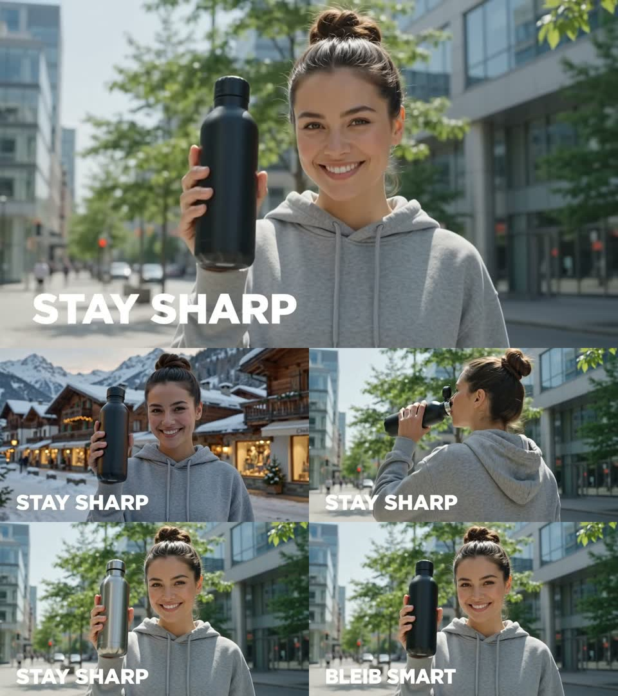
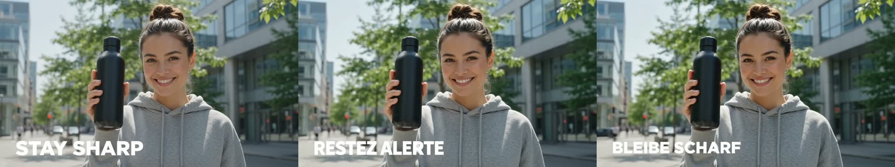
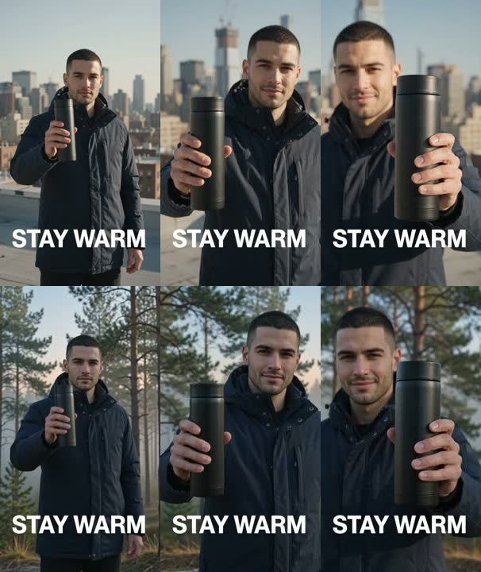
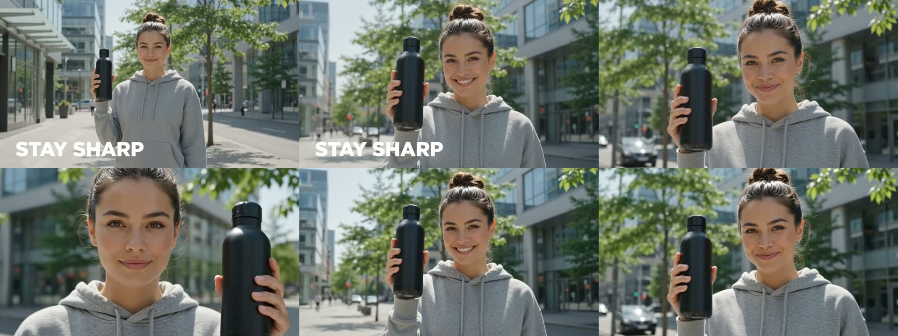
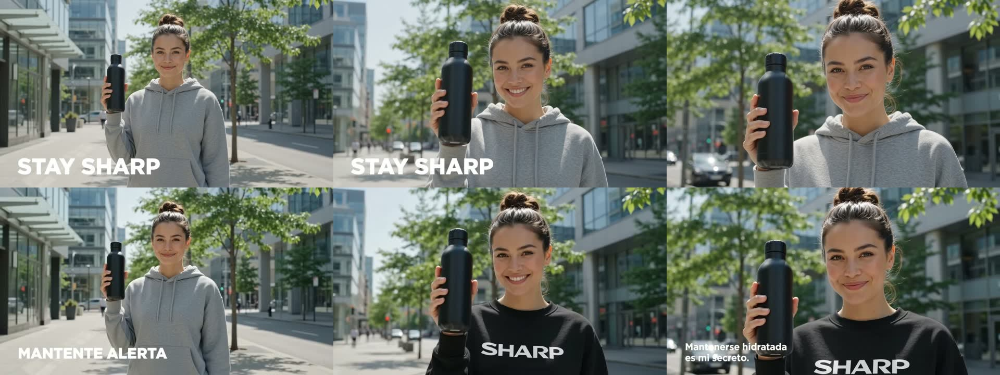

# Beispiele

Ein kompletter Durchlauf, kein Cherry-Picking: **alle vier Ergebnisse hier sind
Erstversuche.** Jedes `.jpg` ist das Kontaktblatt, das das Skript automatisch
mitschreibt — obere Reihe Quelle, untere Reihe Ergebnis, jeweils Anfang, Mitte,
Ende.



## Der Ausgangsclip

`source.mp4` ist selbst mit Omni erzeugt, damit die Beispiele frei
weitergegeben werden können:

```bash
python3 scripts/omni.py create \
  --prompt "A bright commercial lifestyle shot in a single continuous take: a young woman in a plain grey hoodie stands on a sunlit city sidewalk and holds a matte black stainless steel water bottle up beside her shoulder, turning it slightly toward the camera. The camera slowly pushes in. Bold white sans-serif text reading STAY SHARP is burned into the lower third of the frame. Clean modern buildings and green trees behind her, bright natural daylight. No dialogue, soft ambient city sound." \
  --aspect 16:9 --duration 8 --out ./examples --name source
```

8 Sekunden, 1280×720, 24 fps, mit Ton.

## Die vier Läufe

| Datei | Befehl | Ergebnis |
|---|---|---|
| `swap-background.mp4` | `swap-background --to "a snowy alpine village street at dusk with warm shop lights"` | sauber |
| `change-angle.mp4` | `change-angle --angle over-the-shoulder` | neue Perspektive, aber neue Handlung (siehe unten) |
| `transform-object.mp4` | `transform-object --object "the black water bottle" --to "brushed chrome"` | sauber |
| `localize.mp4` | `localize --lang German` | sauber, „STAY SHARP" → „BLEIB SMART" |

Jeweils vollständig, zum Beispiel:

```bash
python3 scripts/omni.py swap-background \
  --input examples/source.mp4 \
  --to "a snowy alpine village street at dusk with warm shop lights" \
  --out ./out
```

Diese vier Läufe entstanden einzeln. Heute würde man dieselbe Reihe als **einen**
Befehl aufrufen — `--to`, `--angle` und `--lang` sind wiederholbar, der Clip wird
dann einmal statt viermal hochgeladen und am Ende entsteht zusätzlich ein
`…-overview.jpg` über alle Varianten:

```bash
python3 scripts/omni.py swap-background --input examples/source.mp4 \
  --to "a snowy alpine village street at dusk with warm shop lights" \
  --to "a rainy Tokyo side street at night" \
  --to "a Miami boardwalk at golden hour" \
  --out ./out
```

## Batch, Hochformat, Nahaufnahme

Später dazugekommen, alle drei aus echten Läufen.

**Ein Batch über zwei Sprachmärkte** — `localize --lang French --lang German`,
ein Befehl, ein Upload, am Ende dieses Überblicksbild. Links die Quelle, daneben
die beiden Varianten:



Nebenbei sichtbar: dieselbe Vorlage wurde in einem früheren Lauf zu
„BLEIB SMART", hier zu „BLEIBE SCHARF". Beides korrektes Deutsch. Wenn eine
bestimmte Formulierung stehen muss, prüfen und notfalls wiederholen.

**Hochformat** — 9:16 rein, 9:16 raus (`vertical-source.mp4` →
`vertical-swap.mp4`), Dachterrasse wird Kiefernwald:



**Nahaufnahme, zweiter Anlauf** (`change-angle-closeup.mp4`). Das Preset
`--angle close-up` lieferte zweimal hintereinander fast die Ausgangskadrierung.
Erst diese Formulierung erzeugte eine echte Nahaufnahme:

```bash
python3 scripts/omni.py change-angle --input examples/source.mp4 \
  --to "a tight close-up framing only the subject's head and the product, filling the frame"
```



Gut zu sehen ist auch die Grenze: links sitzt der enge Ausschnitt, nach rechts
lockert er sich Richtung Original. Deshalb steht das Preset inzwischen so im
Code — und deshalb lohnt der Blick aufs letzte Bild, nicht nur aufs erste.

## Was in diesen Läufen auffällt

**`change-angle` hat eine Handlung erfunden.** In der Quelle hält die Frau die
Flasche neben die Schulter. Im Over-the-Shoulder-Take trinkt sie daraus. Szene,
Kleidung, Licht und der eingebrannte Text stimmen, die Handlung nicht. Für eine
Sequenz, die gegen das Original geschnitten wird, ist das ein Ausschuss — dafür
noch einmal laufen lassen. Als eigenständiger B-Roll-Take ist es brauchbar.
Genau deshalb steht in `change-angle/SKILL.md` „gleiche Handlung" als
Prüfpunkt.

**Der eingebrannte Text hat drei von vier Edits unverändert überlebt.** Bei
`swap-background`, `change-angle` und `transform-object` steht „STAY SHARP"
danach exakt so da wie vorher. Nur `localize` hat ihn angefasst — das war der
Auftrag.

**Echtes Drehmaterial haben wir gegengetestet, aber nicht hier abgelegt.** Alle
Beispiele oben stammen aus KI-erzeugten Clips, deshalb der Gegentest mit einer
echten Studioaufnahme (Person mit Produkt vor rosa Hintergrund, Stockmaterial).
Nach „helles Bad mit weißen Fliesen" waren Gesicht, Zahnspange, Oberteil,
Produkt und Handbewegung Frame für Frame identisch — das sauberste Ergebnis der
ganzen Reihe. Die Dateien liegen nicht im Repo, weil die Lizenz des
Stockanbieters das Weiterverteilen des Materials nicht deckt.

**Zwei Prompt-Rezepte mussten wegen echter Fehlläufe umgeschrieben werden.**

Der Übersetzungs-Prompt sagte ursprünglich „translate all on-screen text,
captions, **labels and signage**". Das lädt das Modell ein, jede Fläche als Ort
für Etiketten zu lesen. So sieht das aus — spanischer Lauf mit dem alten
Rezept:



Die Übersetzung selbst stimmt („MANTENTE ALERTA"). Daneben aber: der Pullover
ist von grau auf schwarz gewechselt, es klebt ein **erfundenes „SHARP"-Logo**
darauf, und unten steht ein kompletter Satz, den nie jemand geschrieben hat
(„Mantenerse hidratada es mi secreto."). In einem anderen Lauf mit demselben
Rezept bekam die glatte schwarze Flasche einen verkrüppelten Schriftzug.

Für eine Marke ist so ein Ergebnis nicht „fast richtig", sondern unbrauchbar —
und auf den ersten Blick sieht es sauber aus. Genau deshalb steht „Buchstabe für
Buchstabe prüfen" in der Checkliste.

Das Rezept heißt jetzt „translate the text that is already visible … do not add
text anywhere, and leave surfaces that have no text on them blank". Bilanz über
alle Läufe: **altes Rezept 2 von 3 Läufen kaputt, neues 2 von 2 sauber**
(Französisch und Deutsch oben). Kleine Stichprobe, aber ein klarer Mechanismus.

**Der Prompt für `swap-background` musste ebenfalls nachgeschärft werden.** Eine frühere
Fassung sagte sinngemäß „Hauptmotiv und Kamerafahrt behalten, Licht an die neue
Szene anpassen". In einem Testlauf mit einer Menschengruppe hat das Modell
daraufhin die Kleidung aller Personen an die neue Szene angepasst. Die
ausgelieferte Fassung benennt stattdessen ausdrücklich „gleiche Gesichter,
gleiche Kleidung, gleiche Farben" — damit blieb die Person im Beispiel oben
identisch.
